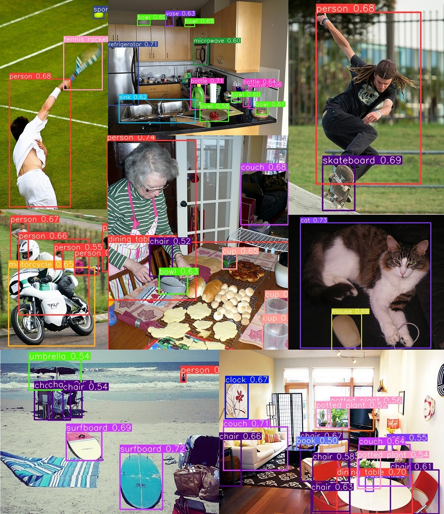

# <a href="https://www.bit.edu.cn"></a> EdgeYOLO: 边缘设备友好的无锚框检测器

<div align="center">

[English](README.md)

</div>

**[1 简介](#简介)**</br>
**[2 更新](#更新)**</br>
**[3 即将到来](#即将到来)**</br>
**[4 模型](#模型)**</br>
**[5 快速使用](#快速使用)**</br>
$\quad$[5.1 setup](#安装)</br>
$\quad$[5.2 推理](#推理)</br>
$\quad$[5.3 训练](#训练)</br>
$\quad$[5.4 验证](#验证)</br>
$\quad$[5.5 导出 onnx & tensorrt](#导出-onnx--tensorrt)</br>
**[6 引用EdgeYOLO](#引用edgeyolo)**</br>
**[7 目前发现的bugs](#目前发现的bugs)**

## 简介
- EdgeYOLO 在嵌入式设备 Nvidia Jetson AGX Xavier 上达到了34FPS，在COCO2017数据集上有**50.6**% AP的准确度，在VisDrone2019-DET数据集上有**25.9**% AP的准确度 **(图像输入大小为640x640, 批大小为16, 包含后处理时间)**。更小的模型EdgeYOLO-S在COCO2017数据集上以**44.1**% AP、**63.3**% AP<sup>0.5</sup>（目前单阶段P5小模型中最好的）准度达到了53FPS的速度。
- 我们提供了更加强大的数据增强方法，可以在数据集标签稀疏时起到更好的效果。
- 在训练末尾阶段使用RH损失函数，中小模型的检测效果有所提升。
- 我们的论文（预印版）已在[**arxiv**](https://arxiv.org/abs/2302.07483)公布

## 更新
**[2023/2/19]** 带有校准训练过程的TensorRT int8模型导出代码

## 即将到来
- 目前evaluate.py不支持tensorrt模型，我们将在近期更新
- MNN 部署代码
- 更多不同的模型
- 用于TensorRT推理的C++代码
- 用于实例分割任务EdgeYOLO-mask模型
- 简单有效的预训练方法

## 模型

- 在COCO2017-train上训练的模型

| 模型           | 输入大小    |mAP<sup>val<br/>0.5:0.95|mAP<sup>val<br/>0.5|FPS<sup>AGX Xavier<br/>trt fp16 批大小=16 <br/>包含NMS|参数量<br/>train / infer</br><sup>(M) |下载|
|:--------------|:---------:|:-----------------------:|:-----------------:|:-------------------------------------------------:|:---------------------------------:|:---:|
|**EdgeYOLO-Tiny-LRELU**|416</br>640|33.1</br>37.8|50.5</br>56.7|**206**</br>109|7.6 / 7.0  |[**github**](https://github.com/LSH9832/edgeyolo/releases/download/v0.0.0/edgeyolo_tiny_lrelu_coco.pth)|
|**EdgeYOLO-Tiny**      |416</br>640|37.2</br>41.4|55.4</br>60.4|136</br>67     |5.8 / 5.5  |[**github**](https://github.com/LSH9832/edgeyolo/releases/download/v0.0.0/edgeyolo_tiny_coco.pth)|
|**EdgeYOLO-S**         |640        |44.1         |**63.3**     |53             |9.9 / 9.3  |[**github**](https://github.com/LSH9832/edgeyolo/releases/download/v0.0.0/edgeyolo_s_coco.pth)|
|**EdgeYOLO-M**         |640        |47.5         |66.6         |46             |19.0 / 17.8|[**github**](https://github.com/LSH9832/edgeyolo/releases/download/v0.0.0/edgeyolo_m_coco.pth)|
|**EdgeYOLO**           |640        |50.6         |69.8         |34             |41.2 / 40.5|[**github**](https://github.com/LSH9832/edgeyolo/releases/download/v0.0.0/edgeyolo_coco.pth)|

- 在VisDrone2019上训练的模型 (这些模型骨干网络初始参数来自于上面的模型)

训练时使用的是 [已转化为COCO格式的 VisDrone2019 数据集](https://github.com/LSH9832/edgeyolo/releases/download/v1.0.0/visdrone_coco.zip) 。

| 模型 |输入大小|mAP<sup>val<br/>0.5:0.95|mAP<sup>val<br/>0.5|下载|
|:----|:----:|:-----------------------:|:----------:|:--------:|
|**EdgeYOLO-Tiny-LRELU**|416</br>640|12.1</br>18.5|22.8</br>33.6|[**github**](https://github.com/LSH9832/edgeyolo/releases/download/v0.0.0/edgeyolo_tiny_lrelu_visdrone.pth)|
|**EdgeYOLO-Tiny**      |416</br>640|14.9</br>21.8|27.3</br>38.5|[**github**](https://github.com/LSH9832/edgeyolo/releases/download/v0.0.0/edgeyolo_tiny_visdrone.pth)|
|**EdgeYOLO-S**         |640        |23.6         |40.8         |[**github**](https://github.com/LSH9832/edgeyolo/releases/download/v0.0.0/edgeyolo_s_visdrone.pth)|
|**EdgeYOLO-M**         |640        |25.0         |42.9         |[**github**](https://github.com/LSH9832/edgeyolo/releases/download/v0.0.0/edgeyolo_m_visdrone.pth)|
|**EdgeYOLO**           |640        |25.9</br>26.4|43.9</br>44.8|[**github(原)**](https://github.com/LSH9832/edgeyolo/releases/download/v0.0.0/edgeyolo_visdrone.pth)</br>[**github(新)**](https://github.com/LSH9832/edgeyolo/releases/download/v1.0.0/edgeyolo_visdrone.pth)|

<details>
<summary>在 COCO2017 上的部分检测结果</summary>



</details>

## 快速使用
### 安装

```shell
git clone https://github.com/LSH9832/edgeyolo.git
cd edgeyolo
pip install -r requirements.txt
```

如果使用TensorRT，请确保设备上已经安装好torch2trt和TensorRT Development Toolkit(version>7.1.3.0)。

```shell
git clone https://github.com/NVIDIA-AI-IOT/torch2trt.git
cd torch2trt
python setup.py install
```
或者为了保证和我们用的是同一个版本的torch2trt, [请在这里下载](https://github.com/LSH9832/edgeyolo/releases/download/v1.0.0/torch2trt.zip)

### 推理

**首先 [在此下载模型的权重文件](https://github.com/LSH9832/edgeyolo/releases/tag/v0.0.0)**

```shell
python detect.py --weights edgeyolo_coco.pth --source XXX.mp4 --fp16

# 完整命令参数
python detect.py --weights edgeyolo_coco.pth      # 权重文件
                 --source /XX/XXX.mp4             # 或网络视频流地址，或目录下全部为图片的文件夹, 如 /dataset/coco2017/val2017 (支持jpg/jpeg, png, bmp, webp格式)
                 --conf-thres 0.25                # 置信度阈值
                 --nms-thres 0.5                  # 重合度阈值
                 --input-size 640 640             # 输入大小
                 --batch 1                        # 批大小
                 --save-dir ./output/detect/imgs  # 如果按下键盘"s"键，当前图像将保存在该文件夹中
                 --fp16                           # 半精度推理
                 --no-fuse                        # 不进行重参数化
                 --no-label                       # 不显示带有类别和置信度的标签，仅画框
                 --mp                             # 使用多进程，当 batch>1 时可以使图像显示更流畅
                 --fps 30                         # 最大FPS限制, 仅在使用 --mp 选项时有效
```

### 训练
- 首先准备好你的数据集并创建好相应的数据集配置文件(./params/dataset/XXX.yaml)，配置文件中应包含如下信息:
```yaml
type: "coco"                        # 数据集格式（小写），目前支持COCO格式、VOC格式、VisDrone格式、DOTA格式
dataset_path: "/dataset/coco2017"   # 数据集根目录

kwargs:
  suffix: "jpg"       # 数据集图片后缀名
  use_cache: true     # 使用缓存文件，在i5-12490f上测试完整加载时间：有分割标签979MB：52s -> 10s, 无分割标签228MB：39s -> 4s

train:
  image_dir: "images/train2017"                   # 训练集图片文件夹
  label: "annotations/instances_train2017.json"   # 训练集标签文件（单文件格式）或文件夹（多文件格式）

val:
  image_dir: "images/val2017"                     # 验证集图片文件夹
  label: "annotations/instances_val2017.json"     # 验证集标签文件（单文件格式）或文件夹（多文件格式）

test:
  test_dir: "test2017"                            # 测试集图片文件夹（代码中暂未使用，后续将会完善）

segmentaion_enabled: true                         # 是否有并且使用实例分割标签代替目标框标签进行训练

names: ['person', 'bicycle', 'car', 'motorcycle', 'airplane', 'bus', 'train', 'truck', 'boat', 'traffic light',
        'fire hydrant', 'stop sign', 'parking meter', 'bench', 'bird', 'cat', 'dog', 'horse', 'sheep', 'cow',
        'elephant', 'bear', 'zebra', 'giraffe', 'backpack', 'umbrella', 'handbag', 'tie', 'suitcase', 'frisbee',
        'skis', 'snowboard', 'sports ball', 'kite', 'baseball bat', 'baseball glove', 'skateboard', 'surfboard',
        'tennis racket', 'bottle', 'wine glass', 'cup', 'fork', 'knife', 'spoon', 'bowl', 'banana', 'apple',
        'sandwich', 'orange', 'broccoli', 'carrot', 'hot dog', 'pizza', 'donut', 'cake', 'chair', 'couch',
        'potted plant', 'bed', 'dining table', 'toilet', 'tv', 'laptop', 'mouse', 'remote', 'keyboard', 'cell phone',
        'microwave', 'oven', 'toaster', 'sink', 'refrigerator', 'book', 'clock', 'vase', 'scissors', 'teddy bear',
        'hair drier', 'toothbrush']    # 类别名称
```
- 修改训练配置文件 ./params/train/train_XXX.yaml中的相应参数
- 最后使用如下命令启动训练

```shell
python train.py --cfg ./params/train/train_XXX.yaml
```

### 验证
```shell
python evaluate.py --weights edgeyolo_coco.pth --dataset params/dataset/XXX.yaml --batch 16 --device 0

# 完整命令参数
python evaluate.py --weights edgeyolo_coco.pth        # 权重文件
                   --dataset params/dataset/XXX.yaml  # 数据集配置文件
                   --batch 16                         # 每一个GPU上的批大小
                   --device 0                         # 只用一个就写0就行
                   --input-size 640 640               # 高、宽（注意别反了）
```

### 导出 onnx & tensorrt
- ONNX
```shell
python export.py --onnx --weights edgeyolo_coco.pth --batch 1

# all options
python export.py --onnx                 # 如果没有安装tensorrt和torch2trt，用--onnx-only代替
                 --weights edgeyolo_coco.pth 
                 --input-size 640 640   # 宽、高（注意别反了）
                 --batch 1
                 --opset 11
                 --no-simplify          # 不简化模型结构
```
将生成
```
output/export/edgeyolo_coco/640x640_batch1.onnx
```
- TensorRT
```shell
# fp16
python export.py --trt --weights edgeyolo_coco.pth --batch 1 --workspace 8

# int8
python export.py --trt --weights edgeyolo_coco.pth --batch 1 --workspace 8 --int8 --dataset params/dataset/coco.yaml --num-imgs 1024

# 完整选项
python export.py --trt                       # 你可以添加上述--onnx和其相关选项，同时导出两种模型
                 --weights edgeyolo_coco.pth
                 --input-size 640 640        # 宽、高（注意别反了）
                 --batch 1
                 --workspace 10              # (GB)
                 --no-fp16        # 默认输出fp16精度模型，使用此选项关闭，转为fp32精度
                 --int8           # 输出int8精度，需要用到以下选项用于校准训练
                 --datset params/dataset/coco.yaml   # 校准训练图片来源于该数据集的验证集图片（上限5120张）
                 --train          # 使用训练集图片而不是验证集图片（上限5120张）
                 --all            # 使用训练集和验证集所有图片（上限5120张）
                 --num-imgs 512   # （上限5120张）
```
将产生
```
(可选)  output/export/edgeyolo_coco/640x640_batch1.onnx
output/export/edgeyolo_coco/640x640_batch1_fp16/int8.pt       # 用于 python 推理
output/export/edgeyolo_coco/640x640_batch1_fp16/int8.engine   # 用于 c++ 推理
output/export/edgeyolo_coco/640x640_batch1_fp16/int8.json     # 用于 c++ 推理
```

#### TensorRT Int8 量化模型基准测试
- 测试环境: TensorRT版本8.2.5.1, Windows, i5-12490F, RTX 3060 12GB
- 增加工作空间和用于校准训练的图片数量也许还能涨点

COCO2017-TensorRT-int8

| Int8 模型  | 尺寸 |校准图片数量|工作内存空间</br><sup>(GB)| mAP<sup>val<br/>0.5:0.95 | mAP<sup>val<br/>0.5 |FPS<sup>RTX 3060<br/>trt int8 batch=16 <br/>include NMS|
|:-------|:----:|:---:|:---:|:---:|:---:|:---:|
|**Tiny-LRELU**|416<br>640|512|8   |31.5<br>36.4 |48.7<br>55.5 | 800<br>360 |
|**Tiny**|416<br>640|512  |8    |34.9<br>39.8|53.1<br>59.5|549<br>288|
|**S**   |640   |512  |8    |42.4 |61.8 | 233 |
|**M**   |640   |512  |8    |45.2 |64.2 | 211 |
|**L**   |640   |512  |8    |49.1 |68.0 | 176 |

#### python推理
```shell
python detect.py --trt --weights output/export/edgeyolo_coco/640x640_batch1_int8.pt --source XXX.mp4

# full commands
python detect.py --trt 
                 --weights output/export/edgeyolo_coco/640x640_batch1_int8.pt 
                 --source XXX.mp4
                 --legacy         # 如果训练时"img = img / 255"（图像输入归一化）
                 --use-decoder    # 如果使用早期的YOLOX（v0.2.0及以前）的tensorrt模型
                 --mp             # 使用多进程，当 batch>1 时可以使图像显示更流畅
                 --fps 30         # 最大FPS限制, 仅在使用 --mp 选项时有效
```

#### c++ 推理
即将发布，敬请期待

## 引用EdgeYOLO
```
 @article{edgeyolo2023,
  title={EdgeYOLO: An Edge-Real-Time Object Detector},
  author={Shihan Liu, Junlin Zha, Jian Sun, Zhuo Li, and Gang Wang},
  journal={arXiv preprint arXiv:2302.07483},
  year={2023}
}
```


## 目前发现的bugs
- 在训练时有时可能会触发以下错误，降低pytorch版本至1.8.0应该可以解决这个问题。
```
File "XXX/edgeyolo/edgeyolo/train/loss.py", line 667, in dynamic_k_matching
_, pos_idx = torch.topk(cost[gt_idx], k=dynamic_ks[gt_idx].item(), largest=False)
RuntimeError: CUDA error: device-side assert triggered
CUDA kernel errors might be asynchronously reported at some other API call,so the stacktrace below might be incorrect.
For debugging consider passing CUDA_LAUNCH_BLOCKING=1.
```
- 对于DOTA数据集，目前我们仅支持单GPU进行训练，请不要使用分布式训练方式对DOTA数据集进行训练，否则无法进行正确的训练，也无法得到正确的结果
- 如果使用TensorRT 8.4.X.X及以上的版本进行半精度模型的转换可能存在丢失大量精度甚至完全没有检出目标的情况，为保证使用请使用TensorRT 7.X.X.X 或 8.2.X.X 的版本
